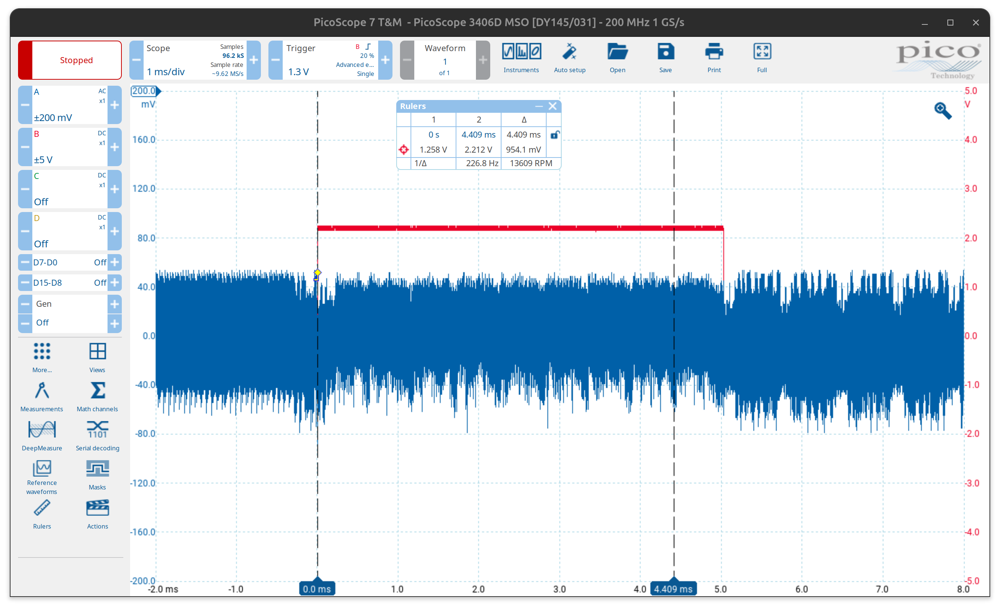

# Fault Injection Attacks

Fault injection attacks are a type of security vulnerability that exploit the behavior of a system when it is subjected to unexpected or erroneous conditions. These attacks can be used to manipulate the execution of a program extract sensitive information.

## Find the Fault Injection Points

First, we identify the potential injection points. As shown in Figure&nbsp;1, we capture the $A$ channel from the DC power supply, which represents the chip's operating power. The $B$ channel corresponds to the AES encryption trigger signal. From the figure, we observe that the approximate running time for the rising edge of the trigger—corresponding to around the 9th round—is close to 4.405&nbsp;ms.

_Figure 1: Captured waveforms for fault injection point analysis._
