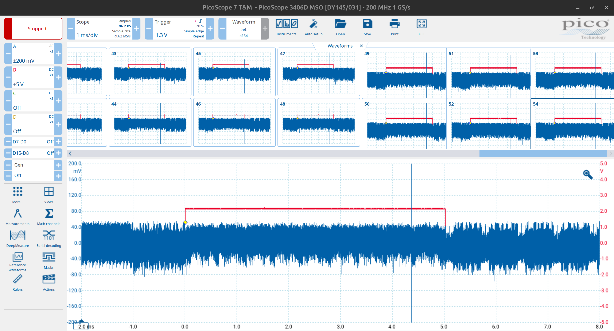

# Fault Injection Attacks

Fault injection attacks are a type of security vulnerability that exploit the behavior of a system when it is subjected to unexpected or erroneous conditions. These attacks can be used to manipulate the execution of a program extract sensitive information.

## Find the Fault Injection Points

First, we identify the potential injection points. As shown in Figure 1, we capture the $A$ channel from the DC power supply, which represents the chip's operating power. The $B$ channel corresponds to the AES encryption trigger signal. From the figure, we observe that the approximate running time for the rising edge of the trigger—corresponding to around the 9th round—is close to 4.405ms.

_Figure 1: Captured waveforms for fault injection point analysis._

## Fault Injection Attack on Voltage Glitch

To perform the fault injection, we use a _voltage glitch attack_. Figure 2 shows the setup for this attack. We attempted more than 50 voltage glitches during the AES encryption process, targeting the period close to the 9th round. In the figure, the blue line drops sharply, indicating the voltage levels during the glitches. Despite these attempts, we did not observe any erroneous ciphertext output, meaning the fault injection was _not successful_.

_Figure 2: Fault injection attack on AES encryption._
