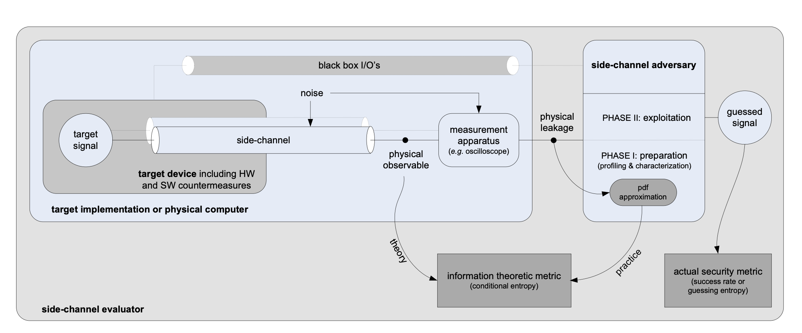

# A Unified Framework for the Analysis of Side-Channel Key Recovery Attacks

_EUROCRYPT 2009_

## Abstract

this work makes a step in this direction and proposes a framework for the analysis of cryptographic implementations that includes a _theoretical model_ and an _application methodology_.

- From a theoretical point of view, we demonstrate _formal_ connections between these metrics and discuss their intuitive meaning.
- From a practical point of view, the model implies a _unified methodology_ for
  the analysis of side-channel key recovery attacks.

## 1 Introduction

we introduce two different types of evaluation metrics. First, an information _theoretic metric_ is used to measure the amount of information that is provided by a given implementation. Second, an _actual security metric_ is used to measure how this information can be turned into a successful attack.

Namely, we suggest to evaluate implementations with an information theoretic metric (_conditional entropy_) and to evaluate attacks and adversaries with security metrics (success rates or _guessing entropy_)

## 2 Background

Each member of the collection is denoted as an _abstract virtual-memory Turing machine_ (VTM for short). One writes $\alpha = (\alpha_1, \alpha_2, ..., \alpha_n)$ to mean that an abstract computer $\alpha$ consists of abstract VTMs $\alpha_1, \alpha_2, ..., \alpha_n$.

A physical computer is a pair $(\alpha, L)$, where $L$ is a **leakage function**. $L(C_\alpha, M, R)$. The first input is the current internal configuration $C_\alpha$ of an abstract computer $\alpha$, which incorporates anything that is in principle measurable. The second input $M$ is the setting of the measuring apparatus (i.e., a specification of what and how the adversary chooses to measure). The third input $R$ is a random string to model the randomness in the measurements.

## 3 Intuitive description of the model and terminology

## 4 Formal definitions

### 4.1 Actual security metrics

Let $\mathcal{E}_K = \{E_k(\cdot)\}_{k \in K}$ be a family of cryptographic abstract computers indexed by a variable key $K$. Let $(\mathcal{E}_K, L)$ be the physical computers corresponding to the association of $\mathcal{E}_K$ with a leakage function $L$.

The attack defines a function $\gamma : K \to S$ which maps each key $k$ onto an equivalent key class $s = \gamma(k)$,

We define a side-channel key recovery adversary as an algorithm $A_{E_K,L}$, with time complexity $\tau$, memory complexity $m$, and $q$ queries to the target physical computer.

We assume that the output of the adversary $A_{E_K,L}$ is a guess vector $g = [g_1, g_2, \ldots, g_{|S|}]$ with the different key candidates sorted according to the attack result:

Finally, we define a side-channel key recovery of order $o$ with the experiment: **Experiment $\mathsf{Exp}^{\mathsf{sc\text{-}kr\text{-}o}}_K$**

$$
\begin{align*}
&k \xleftarrow{R} K; \\
&s = \gamma(k); \\
&\textbf{g} \leftarrow A_{E_k,L}; \\
&\text{if } s \in [g_1, \ldots, g_o] \text{ then return } 1; \\
&\text{else return } 0;
\end{align*}
$$

The $o^{\mathbf{th}}$-order success rate of the side-channel key recovery adversary $A_{E_K,L}$ against a key class variable $S$ is straightforwardly defined as:

$$
\mathsf{Succ}^{\mathsf{sc\text{-}kr\text{-}o},S}_{A_{E_K,L}}(\tau, m, q) = \Pr[\mathsf{Exp}^{\mathsf{sc\text{-}kr\text{-}o}}_{A_{E_K,L}} = 1]
$$

**Guessing entropy.** Using the same notations as for the success rate, we can define a side-channel key guessing experiment: **Experiment $\mathsf{Exp}^{\mathsf{sc\text{-}kg}}_K$**

$$
\begin{align*}
&k \xleftarrow{R} K; \\
&s = \gamma(k); \\
&\textbf{g} \leftarrow A_{E_k,L}; \\
&\text{return } i \text{ such that } g_i = s; \\
\end{align*}
$$

The _guessing entropy_ of the side-channel key recovery adversary $A_{E_K,L}$ against a key class variable $S$ is then defined as:

$$
\mathsf{GE}^{\mathsf{sc\text{-}kr},S}_{A_{E_K,L}}(\tau, m, q) = \mathbb{E}[\mathsf{Exp}^{\mathsf{sc\text{-}kg}}_K]
$$
